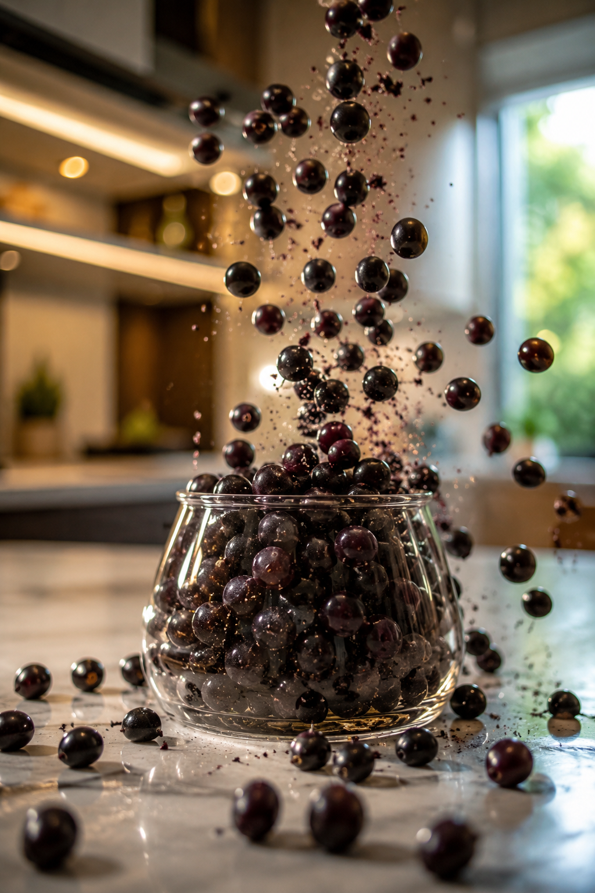

# Açaí Berries — Cinematic Video Prompt

## Visual Prompt

Ultra photorealistic cinematic commercial video, luxury gourmet kitchen with bright natural daylight, premium marble island in the center, elegant modern interior, soft golden highlights reflecting on polished surfaces. Camera positioned in a close-up macro shot focused on an elegant transparent glass vase resting on the island countertop.

Hundreds of fresh açaí berries and seeds are falling from above in slow motion, cascading gracefully into and around the glass container. Some berries bounce off the rim, others roll across the marble surface. Tiny droplets, fruit particles, and natural dust float through the air, illuminated by sunlight. Realistic physics, high-speed camera effect, shallow depth of field, creamy bokeh background, cinematic lens flare, ultra-detailed textures.

The camera slowly pushes forward toward the glass vase while slightly orbiting around it. The focus remains locked on the falling açaí fruits, creating a luxurious premium-food advertisement look. The kitchen background stays softly blurred while the berries remain razor sharp.

Dynamic movement of berries, realistic collisions, subtle reflections on the glass, natural shadows, volumetric lighting, HDR, 8K quality, commercial food photography style, luxury brand advertisement, award-winning cinematography.

## Technical Specifications

| Parameter      | Value                                    |
|----------------|------------------------------------------|
| Duration       | 8 seconds                                |
| FPS            | 60fps                                    |
| Aspect Ratio   | 16:9                                     |
| Camera Motion  | Slow dolly-in + slight orbital movement  |
| Resolution     | 8K / HDR                                 |

## Effects

- Slow motion
- Depth of field
- Motion blur
- Floating particles
- Cinematic light rays

## Sound Design

Soft ambient gourmet kitchen atmosphere, subtle wind movement, realistic fruit impacts on glass and marble, gentle organic falling sounds, premium cinematic ambience.

## Style References

- Apple commercial
- Luxury food advertisement
- National Geographic slow-motion cinematography
- High-end product launch video

## Negative Prompt

cartoon, CGI look, low resolution, blurry berries, dark kitchen, oversaturated colors, unrealistic physics, text, logos, watermark, people, hands, artificial lighting, distorted fruits.

## Reference Image

